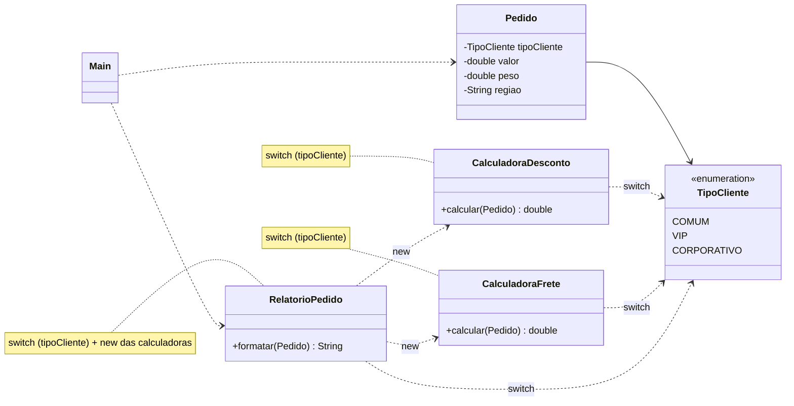
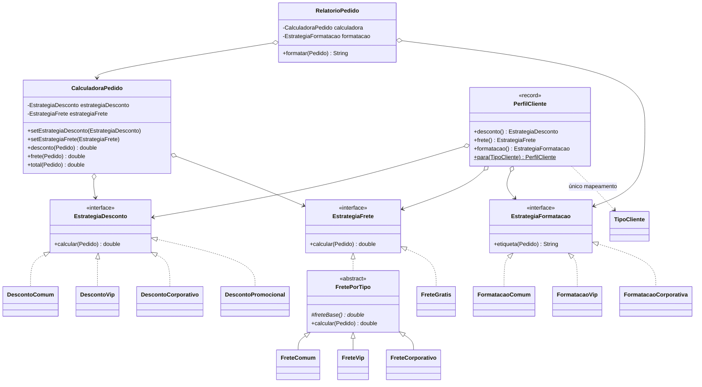

# Atividade 12 — Strategy

Projeto Maven / Java 17 com duas versões do sistema de vendas:

| Pasta | Conteúdo |
|---|---|
| [`antes/`](antes) | Projeto original fornecido (`projeto_strategy_antipattern.zip`), sem alterações |
| [`depois/`](depois) | Versão refatorada com o padrão Strategy, com testes JUnit 5 |

```bash
# antes
cd antes && mvn compile
java -cp target/classes br.venson.net.designpatterns.strategy.Main

# depois
cd depois && mvn test
java -cp target/classes br.venson.net.designpatterns.strategy.Main
```

---

## Exercício 1 — Aplicações

**1. Frete por modalidade (Sedex, PAC, Retirada) sem alterar o `Checkout`: faz sentido usar Strategy.**
É uma família de algoritmos intercambiáveis (cada modalidade calcula o frete de um jeito) e o requisito pede abertura para extensão: uma nova modalidade vira uma nova classe `EstrategiaFrete`, e o `Checkout` só conhece a interface. Isso é o Princípio Aberto/Fechado aplicado na prática.

**2. Pagamentos com Pix, cartão e boleto escolhidos pelo cliente na compra: faz sentido usar Strategy.**
O algoritmo é escolhido em runtime, conforme a escolha do cliente, e cada forma de pagamento tem um fluxo próprio, com o mesmo contrato (`pagar(valor)`). Encapsular cada fluxo em uma estratégia evita um `if/else` gigante no serviço de pagamento e permite testar cada meio isoladamente.

**3. Jogo com fórmulas de dano (bruto, crítico, à distância) combináveis com a mesma lógica de combate: faz sentido usar Strategy.**
A lógica de combate (o contexto) fica estável enquanto a fórmula de dano varia e pode ser trocada pelo jogador durante a partida. Cada fórmula vira uma estratégia, e novas fórmulas entram sem mexer no motor de combate.

**4. `Relatorio` que sempre gera o mesmo PDF, com formato fixo: não faz sentido usar Strategy.**
Existe um único algoritmo, estável, sem variações nem perspectiva de troca. Criar uma interface com uma única implementação seria overengineering: só acrescenta indireção sem nenhum ganho de flexibilidade.

**5. `Ponto` com `x` e `y` que só soma coordenadas: não faz sentido usar Strategy.**
É um objeto de valor trivial, com uma operação matemática única que nunca terá algoritmos alternativos. Aplicar Strategy aqui seria complexidade desnecessária (YAGNI).

---

## Exercício 2 — Rastreando o anti-pattern

A pasta [`antes/`](antes) contém o projeto original, sem modificações. Saída do `Main`:

```
Cliente comum | valor: 200.00 | desconto: 0.00 | frete: 31.00 | total: 231.00
Cliente VIP (10% de desconto) | valor: 200.00 | desconto: 20.00 | frete: 18.00 | total: 198.00
Cliente corporativo (20% de desconto) | valor: 200.00 | desconto: 40.00 | frete: 36.00 | total: 196.00
```

### 1. Onde estão as decisões baseadas em `TipoCliente`?

| Classe | Decisão |
|---|---|
| `CalculadoraDesconto.calcular` | `switch` → 0% / 10% / 20% do valor |
| `CalculadoraFrete.calcular` | `switch` → frete base 25 / 12 / 0 (depois soma peso × 3 e +30 para a região norte) |
| `RelatorioPedido.formatar` | `switch` → etiqueta "Cliente comum" / "Cliente VIP (10% de desconto)" / "Cliente corporativo (20% de desconto)" |

**Três classes repetem o mesmo `switch` sobre o mesmo discriminador.** Isso indica que o conceito "comportamento de um tipo de cliente" não tem um lugar próprio no design: ele está **espalhado** (*shotgun surgery*), e o polimorfismo foi trocado por condicionais. O código viola o Princípio Aberto/Fechado, porque cada nova variação obriga a modificar classes que já funcionam.

Há ainda um sintoma mais sutil: **a mesma regra está duplicada em dois lugares**. Os percentuais "10%" e "20%" existem como número em `CalculadoraDesconto` e como texto em `RelatorioPedido`. Se o desconto VIP mudar para 15%, é fácil atualizar um e esquecer o outro, e o relatório passa a mentir.

### 2. O que muda para adicionar `PARCEIRO`?

1. `TipoCliente.java`: nova constante `PARCEIRO`.
2. `CalculadoraDesconto.java`: novo `case`.
3. `CalculadoraFrete.java`: novo `case` para o frete base.
4. `RelatorioPedido.java`: novo `case` para a etiqueta.
5. `Main.java`: para criar e exibir um pedido do novo tipo.

São **4 arquivos obrigatórios + o `Main`**. Como os `switch` são do estilo antigo (com `default -> throw`), o compilador **não avisa** se algum `case` for esquecido: o erro só aparece em tempo de execução, como `IllegalArgumentException("Tipo de cliente desconhecido")`.

### 3. Por que é difícil testar cada regra isoladamente?

- **Não há como isolar uma regra.** Para testar o desconto VIP é preciso criar um `Pedido` com `TipoCliente.VIP` e passar pelo `switch`, ou seja, o teste exercita o despacho junto com a regra. Cada `case` novo aumenta os caminhos do método, e um teste pode quebrar por causa de outro `case`.
- **Regras misturadas no mesmo método.** `CalculadoraFrete` mistura a parte que varia por tipo (frete base) com regras que valem para todos (peso × 3 e adicional da região norte). Não dá para testar uma sem a outra.
- **Dependências criadas por dentro.** `RelatorioPedido.formatar` faz `new CalculadoraDesconto()` e `new CalculadoraFrete()` dentro do método. Não há como injetar um dublê, então o teste da formatação depende dos cálculos reais de desconto e frete, e qualquer mudança de regra quebra esse teste.
- **Sem troca em runtime.** Pela mesma razão, não dá para aplicar uma regra promocional sem editar o código e recompilar.

### 4. Refatoração com Strategy

| Papel | Classe(s) |
|---|---|
| **Interfaces de estratégia** | `EstrategiaDesconto`, `EstrategiaFrete`, `EstrategiaFormatacao` |
| **Estratégias concretas** | `DescontoComum`, `DescontoVip`, `DescontoCorporativo`, `DescontoPromocional` · `FreteComum`, `FreteVip`, `FreteCorporativo` (herdam de `FretePorTipo`), `FreteGratis` · `FormatacaoComum`, `FormatacaoVip`, `FormatacaoCorporativa` |
| **Contexto que delega** | `CalculadoraPedido`: guarda as estratégias, delega `desconto()`, `frete()` e `total()` e permite trocá-las com `set…` |
| **Montagem (único mapeamento tipo → regras)** | `PerfilCliente.para(TipoCliente)` |
| **Cliente da abstração** | `RelatorioPedido` recebe `CalculadoraPedido` + `EstrategiaFormatacao` pelo construtor e **não referencia `TipoCliente` nem nenhuma classe concreta de regra** |

#### Diagrama de classes — ANTES



#### Diagrama de classes — DEPOIS



#### Código refatorado (trechos principais; o código completo está em [`depois/`](depois/src/main/java/br/venson/net/designpatterns/strategy))

```java
@FunctionalInterface
public interface EstrategiaDesconto {
    double calcular(Pedido pedido);
}

public class DescontoVip implements EstrategiaDesconto {
    public double calcular(Pedido pedido) { return pedido.getValor() * 0.10; }
}

public abstract class FretePorTipo implements EstrategiaFrete {   // parte comum do frete
    protected abstract double freteBase();
    public final double calcular(Pedido pedido) {
        double adicionalRegiao = "norte".equalsIgnoreCase(pedido.getRegiao()) ? 30.0 : 0.0;
        return freteBase() + pedido.getPeso() * 3.0 + adicionalRegiao;
    }
}

public class FreteVip extends FretePorTipo {
    protected double freteBase() { return 12.0; }
}

public class CalculadoraPedido {                                   // contexto
    private EstrategiaDesconto estrategiaDesconto;
    private EstrategiaFrete estrategiaFrete;

    public void setEstrategiaDesconto(EstrategiaDesconto e) { this.estrategiaDesconto = Objects.requireNonNull(e); }
    public double desconto(Pedido p) { return estrategiaDesconto.calcular(p); }
    public double frete(Pedido p)    { return estrategiaFrete.calcular(p); }
    public double total(Pedido p)    { return p.getValor() - desconto(p) + frete(p); }
}

public class RelatorioPedido {                                     // só abstrações
    public RelatorioPedido(CalculadoraPedido calculadora, EstrategiaFormatacao formatacao) { ... }
    public String formatar(Pedido pedido) {
        return String.format("%s | valor: %.2f | desconto: %.2f | frete: %.2f | total: %.2f",
                formatacao.etiqueta(pedido), pedido.getValor(),
                calculadora.desconto(pedido), calculadora.frete(pedido), calculadora.total(pedido));
    }
}

public record PerfilCliente(EstrategiaDesconto desconto, EstrategiaFrete frete, EstrategiaFormatacao formatacao) {
    public static PerfilCliente para(TipoCliente tipo) {
        return switch (tipo) {
            case COMUM       -> new PerfilCliente(new DescontoComum(), new FreteComum(), new FormatacaoComum());
            case VIP         -> new PerfilCliente(new DescontoVip(), new FreteVip(), new FormatacaoVip());
            case CORPORATIVO -> new PerfilCliente(new DescontoCorporativo(), new FreteCorporativo(), new FormatacaoCorporativa());
        };
    }
}
```

O `Main` refatorado produz **exatamente a mesma saída** do original para os três pedidos (o teste `mesmoResultadoQueOProjetoOriginal` também confere isso).

Com isso, adicionar `PARCEIRO` passa a exigir: a constante no enum, as novas classes de estratégia (ou o reuso das existentes, por exemplo `FreteGratis`) e **uma linha** em `PerfilCliente`. O `switch` em expressão é exaustivo, então se a linha for esquecida o **compilador** acusa o erro. `CalculadoraPedido` e `RelatorioPedido` não mudam.

### 5. Troca de comportamento em runtime

Como o contexto guarda a estratégia em um campo e expõe os *setters*, trocar a regra é só trocar o objeto, sem `if`, sem recompilar e sem recriar o relatório:

```java
PerfilCliente perfil = PerfilCliente.para(TipoCliente.COMUM);
CalculadoraPedido calculadora = CalculadoraPedido.para(perfil);
RelatorioPedido relatorio = new RelatorioPedido(calculadora, perfil.formatacao());

calculadora.setEstrategiaDesconto(new DescontoPromocional(30));   // Black Friday
calculadora.setEstrategiaFrete(new FreteGratis());
relatorio.formatar(comum);  // Cliente comum | valor: 200.00 | desconto: 60.00 | frete: 0.00 | total: 140.00

calculadora.setEstrategiaDesconto(perfil.desconto());             // volta à regra padrão
calculadora.setEstrategiaFrete(perfil.frete());
relatorio.formatar(comum);  // Cliente comum | valor: 200.00 | desconto: 0.00 | frete: 31.00 | total: 231.00
```

Esse fluxo está no `Main` da pasta `depois/` e coberto pelo teste `CalculadoraPedidoTest.trocaEstrategiaEmRuntime`.

---

## Justificativa das decisões de design

**Três interfaces de estratégia em vez de uma só.** Desconto, frete e formatação variam por motivos diferentes (comercial, logística e apresentação). Separá-las segue o Princípio da Responsabilidade Única e a Segregação de Interfaces, e permite **combinações** que o design original não permitia: um cliente comum com frete grátis numa campanha, ou um VIP com desconto promocional. Uma interface única com os três métodos levaria de volta ao acoplamento entre as regras.

**Interfaces funcionais (`@FunctionalInterface`).** Cada estratégia tem um único método, então também pode ser escrita como lambda. Isso deixa os testes triviais (`new CalculadoraPedido(p -> 10.0, p -> 5.0)`) e permite criar regras ad hoc sem uma nova classe, quando fizer sentido.

**`FretePorTipo` (Template Method) para a parte comum do frete.** No original, peso × 3 e o adicional da região norte valem para todos os tipos; só o frete base muda. Em vez de copiar essa conta em três estratégias, ela fica numa classe abstrata com `calcular` `final`, e cada subclasse informa só sua `freteBase()`. `FreteGratis` implementa a interface diretamente, o que mostra que uma estratégia não é obrigada a seguir esse molde. Aproveitei para comparar a região com `"norte".equalsIgnoreCase(...)`, que não lança `NullPointerException` se a região vier nula.

**`CalculadoraPedido` como contexto.** O contexto não toma nenhuma decisão: apenas guarda referências às abstrações e delega. Os *setters* com `Objects.requireNonNull` tornam a troca em runtime explícita e segura.

**`PerfilCliente` como único ponto de mapeamento.** Em algum lugar o sistema precisa transformar "tipo do cliente" em "conjunto de regras". Concentrar isso em uma *factory* (um `record` imutável) elimina os três `switch` espalhados. Como o `switch` em expressão é exaustivo em enums, um tipo novo sem mapeamento vira **erro de compilação**, e não exceção em produção. Mantive o `Pedido` original sem alterações.

**`RelatorioPedido` dependente apenas de abstrações (Inversão de Dependência).** Ele recebe as dependências pelo construtor em vez de fazer `new` das calculadoras dentro de `formatar`, e não importa `TipoCliente` nem nenhuma regra concreta. Isso o torna testável de forma isolada (`CalculadoraPedidoTest.relatorioDependeApenasDasAbstracoes` usa estratégias falsas) e fechado para modificação quando surgirem novos tipos de cliente.

**Testes como evidência.** `EstrategiasTest` testa cada regra sozinha, inclusive o desconto VIP isolado, que era a pergunta do README original. `CalculadoraPedidoTest` comprova a delegação, a troca em runtime, o desacoplamento do relatório e a equivalência com o resultado original.
