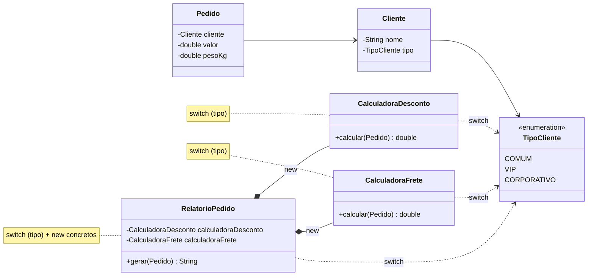
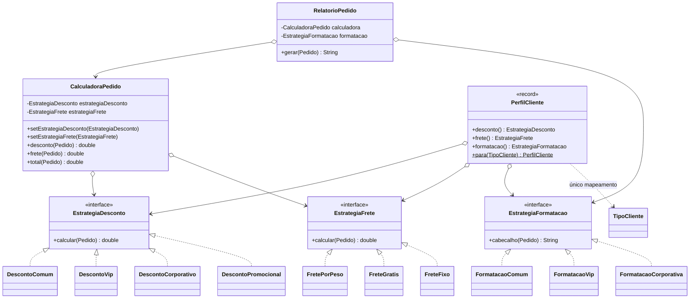

# Atividade 12 — Strategy

Projeto Maven / Java 17 com duas versões do sistema de vendas:

| Pasta | Conteúdo |
|---|---|
| [`antes/`](antes) | Versão com o anti-pattern: `switch (TipoCliente)` repetido em várias classes |
| [`depois/`](depois) | Versão refatorada com o padrão Strategy, com testes JUnit 5 |

```bash
# antes
cd antes && mvn compile
java -cp target/classes br.venson.net.designpatterns.strategy.Main

# depois
cd depois && mvn test
java -cp target/classes br.venson.net.designpatterns.strategy.Main
```

---

## Exercício 1 — Aplicações

**1. Frete por modalidade (Sedex, PAC, Retirada) sem alterar o `Checkout`: faz sentido usar Strategy.**
É uma família de algoritmos intercambiáveis (cada modalidade calcula o frete de um jeito) e o requisito pede abertura para extensão: uma nova modalidade vira uma nova classe `EstrategiaFrete`, e o `Checkout` só conhece a interface. Isso é o Princípio Aberto/Fechado aplicado na prática.

**2. Pagamentos com Pix, cartão e boleto escolhidos pelo cliente na compra: faz sentido usar Strategy.**
O algoritmo é escolhido em runtime, conforme a escolha do cliente, e cada forma de pagamento tem um fluxo próprio, com o mesmo contrato (`pagar(valor)`). Encapsular cada fluxo em uma estratégia evita um `if/else` gigante no serviço de pagamento e permite testar cada meio isoladamente.

**3. Jogo com fórmulas de dano (bruto, crítico, à distância) combináveis com a mesma lógica de combate: faz sentido usar Strategy.**
A lógica de combate (o contexto) fica estável enquanto a fórmula de dano varia e pode ser trocada pelo jogador durante a partida. Cada fórmula vira uma estratégia, e novas fórmulas entram sem mexer no motor de combate.

**4. `Relatorio` que sempre gera o mesmo PDF, com formato fixo: não faz sentido usar Strategy.**
Existe um único algoritmo, estável, sem variações nem perspectiva de troca. Criar uma interface com uma única implementação seria overengineering: só acrescenta indireção sem nenhum ganho de flexibilidade.

**5. `Ponto` com `x` e `y` que só soma coordenadas: não faz sentido usar Strategy.**
É um objeto de valor trivial, com uma operação matemática única que nunca terá algoritmos alternativos. Aplicar Strategy aqui seria complexidade desnecessária (YAGNI).

---

## Exercício 2 — Rastreando o anti-pattern

> **Observação:** o ambiente usado para preparar a entrega não conseguiu acessar `designpatterns.venson.dev` (bloqueio de rede), por isso a pasta `antes/` é uma **reconstrução fiel ao enunciado**: mesmo pacote (`br.venson.net.designpatterns.strategy`), mesmo `TipoCliente` (`COMUM`, `VIP`, `CORPORATIVO`) e as mesmas três responsabilidades (desconto, frete e relatório) decididas por `switch`.

### 1. Onde estão as decisões baseadas em `TipoCliente`?

| Classe | Decisão |
|---|---|
| `CalculadoraDesconto.calcular` | `switch` → 0% / 10% / 15% (ou 5%) |
| `CalculadoraFrete.calcular` | `switch` → por peso / grátis / fixo R$ 25 |
| `RelatorioPedido.gerar` | `switch` → formato do cabeçalho |

**Três classes repetem o mesmo `switch`.** Isso indica que o conceito "comportamento de um tipo de cliente" não tem um lugar próprio no design: ele está **espalhado** (*shotgun surgery*) e acoplado a um enum. É um sinal clássico de que o polimorfismo foi trocado por condicionais e de que o código viola o Princípio Aberto/Fechado: cada nova variação obriga a modificar código que já funciona.

### 2. O que muda para adicionar `PARCEIRO`?

1. `TipoCliente.java`: nova constante `PARCEIRO`.
2. `CalculadoraDesconto.java`: novo `case`.
3. `CalculadoraFrete.java`: novo `case`.
4. `RelatorioPedido.java`: novo `case`.
5. `Main.java` (ou quem cria os pedidos), para usar o novo tipo.

Ou seja, **4 a 5 arquivos**, e se alguém esquecer um `case` o erro só aparece em tempo de execução (`default -> throw`), porque o `switch` clássico não obriga a cobrir todos os valores.

### 3. Por que é difícil testar cada regra isoladamente?

- As regras de **todos** os tipos estão no mesmo método. Para testar o desconto VIP é preciso montar um `Cliente` com `TipoCliente.VIP` e passar pelo `switch`, ou seja, o teste exercita o despacho junto com a regra.
- `RelatorioPedido` **instancia** `new CalculadoraDesconto()` e `new CalculadoraFrete()` internamente. Não dá para injetar um dublê, então testar só a formatação obriga a calcular desconto e frete reais: qualquer mudança de regra quebra o teste de formatação.
- Cada `case` adicionado aumenta a complexidade ciclomática do método e o número de caminhos a cobrir. Um teste de um `case` pode falhar por causa de outro.

### 4. Refatoração com Strategy

| Papel | Classe(s) |
|---|---|
| **Interfaces de estratégia** | `EstrategiaDesconto`, `EstrategiaFrete`, `EstrategiaFormatacao` |
| **Estratégias concretas** | `DescontoComum`, `DescontoVip`, `DescontoCorporativo`, `DescontoPromocional` · `FretePorPeso`, `FreteGratis`, `FreteFixo` · `FormatacaoComum`, `FormatacaoVip`, `FormatacaoCorporativa` |
| **Contexto que delega** | `CalculadoraPedido` (guarda as estratégias, delega `desconto()`, `frete()` e `total()`, e permite trocá-las com `set…`) |
| **Montagem (único mapeamento tipo → regras)** | `PerfilCliente.para(TipoCliente)` |
| **Cliente da abstração** | `RelatorioPedido` recebe `CalculadoraPedido` + `EstrategiaFormatacao` pelo construtor e **não referencia `TipoCliente` nem nenhuma classe concreta de regra** |

#### Diagrama de classes — ANTES



#### Diagrama de classes — DEPOIS



#### Código refatorado (trechos principais; o código completo está em [`depois/`](depois/src/main/java/br/venson/net/designpatterns/strategy))

```java
@FunctionalInterface
public interface EstrategiaDesconto {
    double calcular(Pedido pedido);
}

public class DescontoVip implements EstrategiaDesconto {
    public double calcular(Pedido pedido) { return pedido.getValor() * 0.10; }
}

public class CalculadoraPedido {                       // contexto
    private EstrategiaDesconto estrategiaDesconto;
    private EstrategiaFrete estrategiaFrete;

    public void setEstrategiaDesconto(EstrategiaDesconto e) { this.estrategiaDesconto = Objects.requireNonNull(e); }
    public double desconto(Pedido p) { return estrategiaDesconto.calcular(p); }
    public double frete(Pedido p)    { return estrategiaFrete.calcular(p); }
    public double total(Pedido p)    { return p.getValor() - desconto(p) + frete(p); }
}

public class RelatorioPedido {                         // só abstrações
    public RelatorioPedido(CalculadoraPedido calculadora, EstrategiaFormatacao formatacao) { ... }
    public String gerar(Pedido pedido) { /* formatacao.cabecalho(...) + calculadora.total(...) */ }
}

public record PerfilCliente(EstrategiaDesconto desconto, EstrategiaFrete frete, EstrategiaFormatacao formatacao) {
    public static PerfilCliente para(TipoCliente tipo) {
        return switch (tipo) {
            case COMUM       -> new PerfilCliente(new DescontoComum(), new FretePorPeso(), new FormatacaoComum());
            case VIP         -> new PerfilCliente(new DescontoVip(), new FreteGratis(), new FormatacaoVip());
            case CORPORATIVO -> new PerfilCliente(new DescontoCorporativo(), new FreteFixo(25.0), new FormatacaoCorporativa());
        };
    }
}
```

Com isso, adicionar `PARCEIRO` passa a exigir: a constante no enum, as novas classes de estratégia (ou o reuso das existentes, por exemplo `FreteGratis`) e **uma linha** em `PerfilCliente`. O `switch` em expressão é exaustivo, então se a linha for esquecida o **compilador** acusa o erro. `CalculadoraPedido` e `RelatorioPedido` não mudam.

### 5. Troca de comportamento em runtime

Como o contexto guarda a estratégia em um campo e expõe `setEstrategiaDesconto`, trocar a regra é só trocar o objeto, sem `if` e sem recriar o relatório:

```java
PerfilCliente perfil = PerfilCliente.para(TipoCliente.COMUM);
CalculadoraPedido calculadora = CalculadoraPedido.para(perfil);
RelatorioPedido relatorio = new RelatorioPedido(calculadora, perfil.formatacao());

calculadora.setEstrategiaDesconto(new DescontoPromocional(30)); // Black Friday
relatorio.gerar(pedido);   // Desconto: R$ 60,00 · Total: R$ 161,00

calculadora.setEstrategiaDesconto(perfil.desconto());           // volta à regra padrão
relatorio.gerar(pedido);   // Desconto: R$ 0,00  · Total: R$ 221,00
```

Esse fluxo está no `Main` da pasta `depois/` e coberto pelo teste `CalculadoraPedidoTest.trocaEstrategiaEmRuntime`.

---

## Justificativa das decisões de design

**Três interfaces de estratégia em vez de uma só.** Desconto, frete e formatação variam por motivos diferentes (comercial, logística e apresentação). Separá-las segue o Princípio da Responsabilidade Única e a Segregação de Interfaces, e permite **combinações** que o design antigo não permitia, como um cliente comum com frete grátis numa campanha ou um VIP com desconto promocional. Uma interface única "PerfilCliente com três métodos" levaria de volta ao acoplamento entre as regras.

**Interfaces funcionais (`@FunctionalInterface`).** Cada estratégia tem um único método, então também pode ser escrita como lambda. Isso deixa os testes triviais (`new CalculadoraPedido(p -> 10.0, p -> 5.0)`) e permite criar regras ad hoc sem uma nova classe, quando fizer sentido.

**Estratégias concretas parametrizáveis quando a regra é só um número** (`FreteFixo(valor)`, `DescontoPromocional(percentual)`). Assim se evita uma explosão de classes quase idênticas e a regra continua encapsulada e validada (o percentual fora de 0–100 é rejeitado).

**`CalculadoraPedido` como contexto.** O contexto não toma nenhuma decisão: apenas guarda referências às abstrações e delega. Os *setters* com `Objects.requireNonNull` tornam a troca em runtime explícita e segura.

**`PerfilCliente` como único ponto de mapeamento.** Em algum lugar o sistema precisa transformar "tipo do cliente" em "conjunto de regras". Concentrar isso em uma *factory* (um `record` imutável) elimina a repetição dos três `switch` antigos. Como o `switch` em expressão é exaustivo em enums, um tipo novo sem mapeamento vira **erro de compilação**, e não exceção em produção.

**`RelatorioPedido` dependente apenas de abstrações (Inversão de Dependência).** Ele recebe suas dependências pelo construtor em vez de fazer `new` das calculadoras e não importa `TipoCliente` nem nenhuma regra concreta. Isso o torna testável de forma isolada (`CalculadoraPedidoTest.relatorioDependeApenasDasAbstracoes` usa estratégias falsas) e fechado para modificação quando surgirem novos tipos de cliente.

**Testes como evidência.** `EstrategiasTest` testa cada regra sozinha e `CalculadoraPedidoTest` comprova a delegação, a troca em runtime e o desacoplamento do relatório. Era justamente o que o design com `switch` dificultava.
